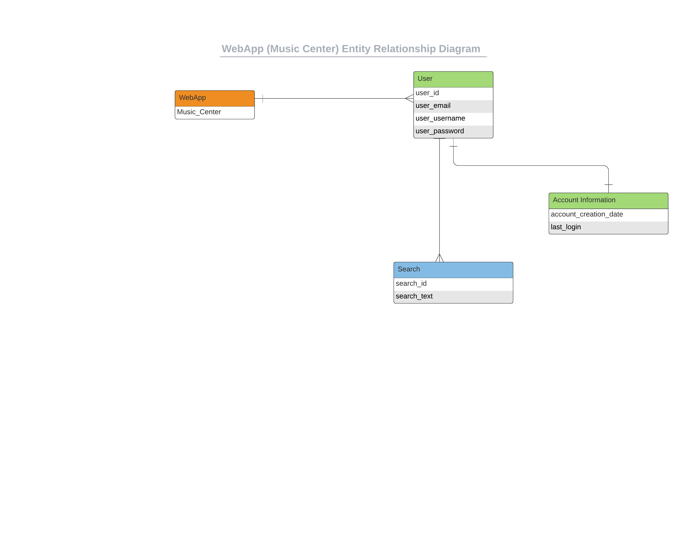

# WebApp Assignment 2

### Note to professor for grading

We ran into some trouble while creating accounts for new users.
Thus, we have created 3 users manually in our sqlite DB.
As of now, we have completed the requirements for assignment 3 
as best we could. There were some requirements of assignment 2 
that are still incomplete right now, but we are working on them.
They will be fixed for the final project.

We have created a sample dashboard page that is directly by calling /dashboard 
(so that you can grade us for assignment 3's requirements. We ran into some 
login trouble in assignment 2, and thus we have made this page public for now.)
You can test our API call from this page.

The ERD Diagram provided shows the currently created DB, along with
certain other DB/Information that we will be adding once we sort 
out the requirements we missed for assignment 2. The 'Account 
Information' and 'Search History' entities will be added to the 
WebApp later.

### About the WebApp
The name of our application is Music Center.
Music Center is a one-stop shop for music lovers who can listen, share, 
and engage with the music they love.

### API

### SQLite

### Entity Relationship Diagram

